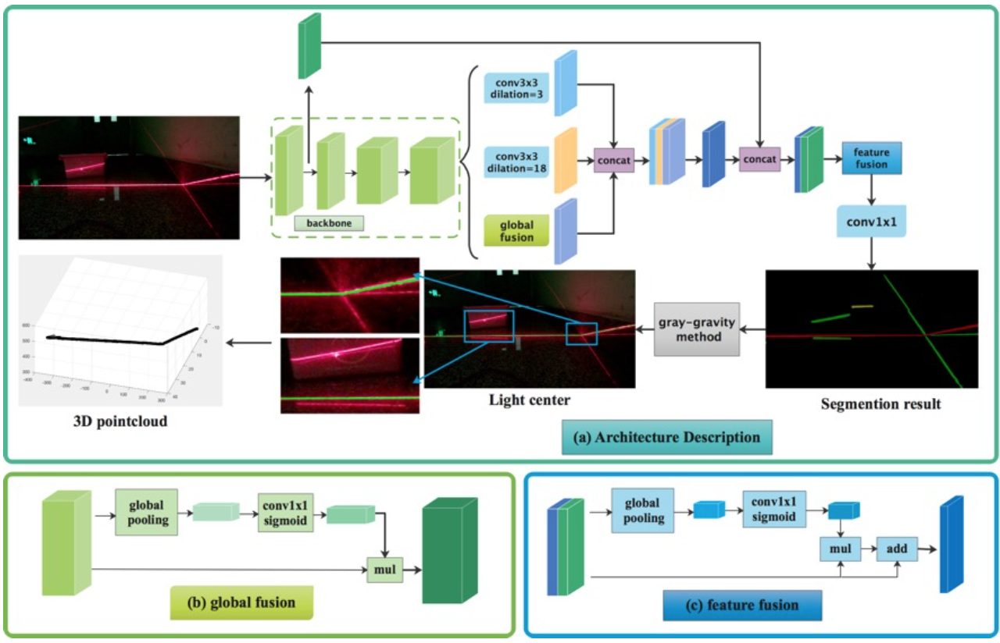
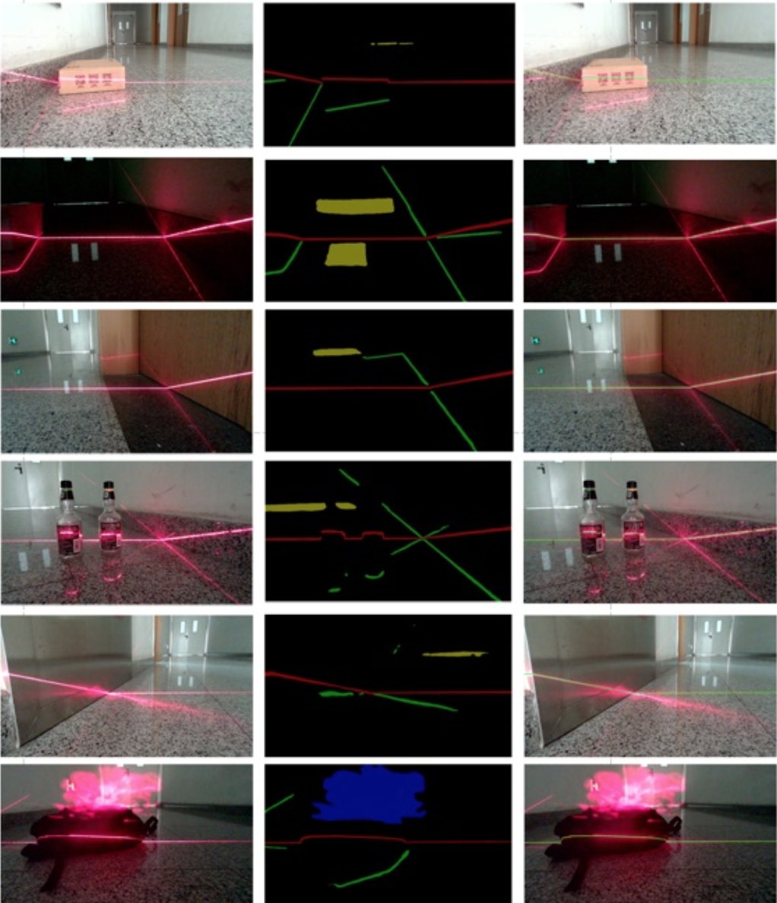

# Laser-stripe-detection-neural-network

**Update on 2020/07/20. Provide model trained on my own datasets.**  

### TODO
- [x] Support different backbones
- [x] Multi-GPU training


| Backbone  | train/eval epoch  |mIoU in val |
| :-------- | :------------: |:---------: |
| ResNet    | 300            | 74.31%     | 
| MobileNet | 300            | 70.04%     | 
| DRN       | 300            | 63.14%     | 


### Introduction
This is a PyTorch(1.12.1) implementation of Laser-stripe-detection-neural-network(LSDNN) which can eliminate the interference of reflective noise and haze noise and realize the highly robust extraction of laser stripes region.



The result of segmentation and extraction dealing with different noises. the input image (1920×1920 pixels). The middle column is the output of our network, where different colors denote different categories. The right column is the result of the center extraction based on the segmentation. The laser stripe’s center is marked as green.



### Dataset
Dataset we used is made by ourselves. You can download the dataset from [baiduyun](链接:https://pan.baidu.com/s/1FA93B6Gzby5eESHk-RnT_Q  密码:gq6u).

To facilitate downloading, we are publishing part of our dataset. If you need all the data, please contact us at zcy1517@buaa.edu.cn

### More result image
You can download the more result image from [baiduyun](链接:https://pan.baidu.com/s/1iqZaRA9uIqyWa7jJ7Tfh5A  密码:6n4y).


### Installation
The code was tested with Anaconda and Python 3.6. After installing the Anaconda environment:

0. Clone the repo:
    ```Shell
    git clone git@github.com:zhaocongyang/LSDNN.git
    cd LSDNN
    ```

1. Install dependencies:

    For PyTorch dependency, see [pytorch.org](https://pytorch.org/) for more details.

    For custom dependencies:
    ```Shell
    pip install matplotlib pillow tensorboardX tqdm
    ```
### Training
Fellow steps below to train your model:

0. Configure your dataset path in [mypath.py](https://github.com/zhaocongyang/LSDNN/blob/master/mypath.py).

1. To train LSDNN using our dataset and ResNet as backbone:
    ```Shell
    sh train_voc.sh
    ```
### Testing
Fellow steps below to test your model:

0. You can download model trained by us from [baiduyun](链接:https://pan.baidu.com/s/1h4X0UaKIeff4ZBC1oU1C2A  密码:r3k7).

1. To test the model

    ```Shell
    CUDA_VISIBLE_DEVICES=0 python test_center_gpu_sensors.py
    ```

### demo with single image
Fellow steps below to run a demo:

0. Configure your image path 

1. To run a demo 

    ```Shell
    CUDA_VISIBLE_DEVICES=0 python single_demo.py
    ```
